# Getting Started With Git — Workshop Facilitator Guide

Welcome! This guide outlines the exact step-by-step workflow for hosting your **"Getting Started With Git"** live collaborative workshop.

---

## 📋 Recommended Time Breakdown (60 - 75 Minutes Total)

```mermaid
gantt
    title Workshop Flow Schedule
    dateFormat  m
    axisFormat %M min

    section Phase 1: Interactive Slides
    Concepts & Git Commands (`slides.html`)   :a1, 0, 20m

    section Phase 2: Live Demo
    Host Demonstrates Cloning & PR Flow       :a2, 20, 30m

    section Phase 3: Hands-On Activity
    Students Clone, Add JSON Profile, Push PR :a3, 30, 60m

    section Phase 4: Live PR Merging
    Facilitator Pulls PRs & Wall Updates Live :a4, 60, 70m
```



---

## 🎯 Step-by-Step Workshop Flow

### Step 1: Present the Slides (`slides.html`) — 20 Mins
1. Open `slides.html` in your web browser and press `F` for Fullscreen projector view.
2. Walk students through the 18 slides covering:
   - **Slide 1-5**: Why Git & GitHub exist (Version Control vs. `v1_final_final.zip`).
   - **Slide 6-11**: Core Git concepts (Repository, Working Tree, Staging Area, Commits, Branches).
   - **Slide 12-16**: Essential terminal commands (`clone`, `checkout -b`, `add`, `commit`, `push`, `pull`).
   - **Slide 17-18**: Workshop goal introduction — contributing your card to the **Student Attendance Gallery** (`index.html`).

> [!TIP]
> Emphasize to students that typing terminal commands manually builds muscle memory. The slides intentionally block clipboard copying for this reason!

---

### Step 2: Live Facilitator Demonstration — 10 Mins
Before letting students type on their own, share your projector screen and demonstrate the exact sequence live:

1. **Show the Wall**: Open `index.html` on your screen — point out that there is currently **1 card** (yours as the Workshop Lead).
2. **Demonstrate Terminal Commands**:
   ```bash
   # 1. Clone the repository
   git clone https://github.com/your-org/git-ready.git
   cd git-ready

   # 2. Create a feature branch
   git checkout -b student/your-name

   # 3. Create your profile JSON file under data/students/
   cp data/students/_template.json data/students/your-name.json
   ```
3. **Show File Editing**: Open `data/students/your-name.json` in VS Code/Sublime/Notepad, change the values, and save.
4. **Stage, Commit, & Push**:
   ```bash
   git add .
   git commit -m "feat: add my profile card"
   git push origin student/your-name
   ```
5. **Open Pull Request**: Navigate to GitHub on projector screen and click **"Compare & pull request"**.

---

### Step 3: Student Hands-On Activity — 30 Mins
1. Share the GitHub repository URL on the screen or in class chat.
2. Circulate around the room with co-facilitators/tutors to help students with:
   - Git CLI installation or terminal navigation issues.
   - Creating their JSON profile format correctly under `data/students/`.
   - Resolving typos in Git commands.

---

### Step 4: Live PR Merging & Celebration — 10 Mins
1. Keep the **Student Attendance Gallery** (`index.html`) displayed on the main projector screen.
2. As students submit Pull Requests on GitHub:
   - Click **"Merge Pull Request"** on GitHub.
   - Run `git pull origin main` on your facilitator laptop.
   - **Refresh `index.html` on the projector screen!**
3. Watch the room light up as each student's card instantly pops up **at the top of the gallery grid** in real-time, incrementing the live participant counter!

---

## ⚡ Quick Facilitator Cheat Sheet

| Situation | Solution |
| :--- | :--- |
| **Student has merge conflicts** | Guide them to run `git pull origin main` on their branch, resolve conflicts, commit, and push. |
| **JSON syntax error** | Verify missing commas or unquoted strings in their `data/students/<name>.json`. |
| **Card not showing after pull** | Check if file is placed directly inside `data/students/` and ends with `.json`. |
